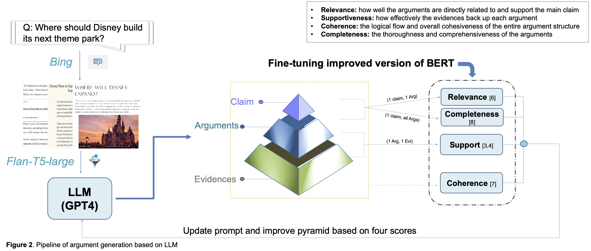

# Fact-driven Storytelling with LLMs 🌐

## Overview 📖
This repository contains the implementation of a system that leverages large language models (LLMs) for generating argument pyramids, focusing on the relevance of claims with arguments, support of arguments with evidences, and the overall logical coherence.

## Model Weights 📦
The model weights are hosted on Google Drive due to their size. Access them [here](https://drive.google.com/drive/folders/1UPbiBLuExIKfrYGkbWyj4pBYlNavgjLO?usp=sharing).

### BERT Model 📘
- **File**: `model.safetensors`
- **Location**: Download and place it under `models/bert_model`.
- **Purpose**: Calculates the relevance score between claims and arguments.

### RoBERTa Model 📗
- **File**: `best_model.pt`
- **Location**: Download and place it under `models/roberta_model`.
- **Purpose**: Used to assess the support score between arguments and evidences.

### ALBERT Model 📙
- **File**: `pytorch_model.bin`
- **Location**: Download and place it under `models/albert_model`.
- **Source**: From CoUDA project: "Coherence Evaluation via Unified Data Augmentation" (NAACL 2024).
- **Purpose**: Evaluates the overall logical coherence score of the pyramid.

## Setup and Configuration ⚙️
Configure the necessary API keys before use:
1. Navigate to the `config` folder.
2. Enter your OpenAI and Bing API keys for content generation and data fetching.

## Usage 🚀
To generate argument pyramids:
1. Modify the `question` in `main.py` to set your query.
2. Set `num_pyramids` to define how many successful pyramids to generate.
3. Run `main.py`. The system will generate multiple pyramids and select the one with the highest score.

## Cost and Performance 💰
- Generation uses GPT-4, costing approximately $1.50 and taking about 4 minutes on a GPU-T4.
- Using GPT-3.5 turbo can result in unpredictable quality and may not conform to detailed prompt structures necessary for improvements.

## Note 📝
Regular expressions extract claims, arguments, and evidences from GPT-generated content. Format inconsistencies might cause bugs, sometimes requiring a restart of the generation process.

For detailed methodology and computational requirements, see `Poster.pdf` in this repository.
